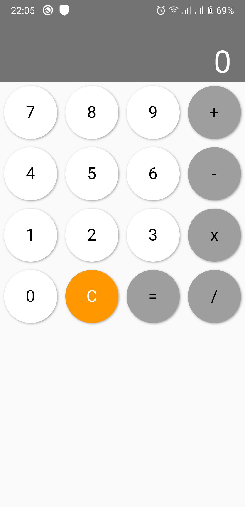
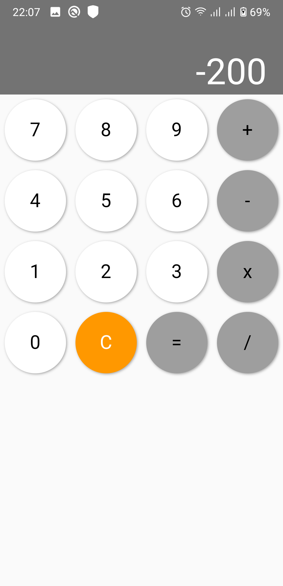

# Description

This is a simple Flutter Calculator App.

## Student information

Name: Phạm Đức Duy

ID: 17021224

## Functions

This app can perform simple calculations: add, subtract, multiply, divide with integers.

Since this app does not work with floats, division can only result in integers.

A Clear button to help the user clear the states and define new equations is also implemented.

## Installation

* Clone this project
* Make sure to connect your computer to at least 1 mobile device or simulator
* With Android Studio
    * Click `Run > Run 'main.dart'` or Shift + F10
* With Terminal
    * Run command `flutter pub` get to install dependencies
    * Run command `flutter run`

## Screenshots

